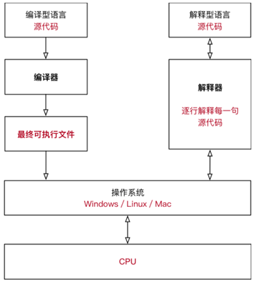

## 解释器

计算机不能直接理解任何除**机器语言**以外的语言，所以必须要把程序员所写的程序语言翻译成机器语言，计算机才能执行程序。

将其他语言翻译成机器语言的工具，被称为**编译器**。

编译器翻译的方式有两种：一个是编译，另外一个是解释。两种方式之间的区别在于翻译时间点的不同。

当编译器以解释方式运行的时，也称之为解释器。

**编译型语言**：

程序在执行之前需要一个专门的编译过程，把程序编译成为机器语言的文件，运行时不需要重新翻译，直接使用编译的结果。

程序执行效率高，依赖编译器，跨平台性差些。如 C、C++

**解释型语言**：

解释型语言编写的程序不进行预先编译，以文本方式存储程序代码，会将代码一句一句直接运行。

在发布程序时，看起来省了道编译工序，但是在运行程序的时候，必须先解释再运行

**编译型语言和解释型语言对比**

速度 —— 编译型语言比解释型语言执行速度快

跨平台性 —— 解释型语言比编译型语言跨平台性好

## python特点

- Python 是完全面向对象的语言

- 函数、模块、数字、字符串都是对象，在 Python 中一切皆对象

- 完全支持继承、重载、多重继承

- 支持重载运算符，也支持泛型设计

\- Python 拥有一个强大的标准库，Python 语言的核心只包含 数字、字符串、列表、字典、文件 等常见类型和函数，而由 Python 标准库提供了 系统管理、网络通信、文本处理、数据库接口、图形系统、XML 处理 等额外的功能

\- Python 社区提供了大量的第三方模块，使用方式与标准库类似。它们的功能覆盖 科学计算、人工智能、机器学习、Web 开发、数据库接口、图形系统 多个领域

